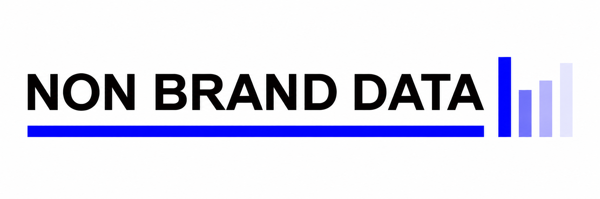

  

# AI for Data Science Resources

Learning resources to use AI throughout our data science workflow.

AI is now used in many parts of data science. We can use it to explore a dataset, write SQL, create a machine learning baseline, or turn repeated code into a project.

However, finding a place to learn each activity is not always easy. There are many resources that mention AI, but not all of them show us how it works with data.

For me, the goal of this repository is simple. I want to collect resources that we can learn from and try in our data science work. Each resource should explain the method, provide something we can follow, or help us build a result we can check.

The collection does not need every available AI tool. We only need the resources that help us understand what we are doing, where it can help, and where we still need to be careful.

Curated by [Non-Brand Data](https://www.nb-data.com/), an independent publication by [Cornellius Yudha Wijaya](https://www.linkedin.com/in/cornellius-yudha-wijaya/).

<!-- STATUS_START -->
**Last reviewed:** 2026-10-04  
**Resources:** 85  
**Categories:** 11
<!-- STATUS_END -->

## Where should I start?

It depends on what we want to build. For example, learning to use AI in our current analysis work is different from building a data agent.

Choose the path that is closest to your work and try it with a dataset you already understand. We can always explore another path later.

- **Use AI in my current data science work:** [analysis and SQL](resources/ai-assisted-analysis-and-sql.md) -> [coding agents and context](resources/coding-agents-and-context.md) -> [AI-assisted ML](resources/ai-assisted-machine-learning.md)
- **Build data agents:** [coding agents and context](resources/coding-agents-and-context.md) -> [data science agents](resources/data-science-agents.md) -> [evaluation](resources/evaluation-and-reproducibility.md)
- **Improve ML workflows:** [AI-assisted ML](resources/ai-assisted-machine-learning.md) -> [tabular foundation models](resources/tabular-foundation-models.md) -> [MLOps](resources/mlops-and-production.md)
- **Move from notebook to production:** [coding agents and context](resources/coding-agents-and-context.md) -> [evaluation](resources/evaluation-and-reproducibility.md) -> [MLOps](resources/mlops-and-production.md)
- **Try foundation models for forecasting:** [time series foundation models](resources/time-series-foundation-models.md) -> [evaluation](resources/evaluation-and-reproducibility.md) -> [MLOps](resources/mlops-and-production.md)

The detailed steps and expected outputs are available in [`learning-paths/`](learning-paths/).

## Browse by data science workflow

Not every workflow has the same number of resources. That is fine. We add a resource when it teaches something we can try, not because every category needs to have the same number.

<!-- CATEGORY_TABLE_START -->
| Workflow area | What it covers | Resources |
|---|---|---:|
| [AI-Assisted Analysis and SQL](resources/ai-assisted-analysis-and-sql.md) | Use AI to explore datasets, write and inspect SQL, and move from a question to a reproducible analysis. | 10 |
| [AI for Data Preparation and Extraction](resources/data-preparation-and-extraction.md) | Turn documents and messy inputs into structured, validated data that can enter an analysis workflow. | 8 |
| [AI-Assisted Machine Learning](resources/ai-assisted-machine-learning.md) | Build strong baselines, compare models, and automate repetitive parts of supervised machine learning. | 7 |
| [Tabular Foundation Models](resources/tabular-foundation-models.md) | Try pretrained models designed for tabular prediction and compare them with established tree-based baselines. | 6 |
| [Coding Agents and Context Engineering](resources/coding-agents-and-context.md) | Use coding agents safely in notebooks and repositories, with durable project instructions and business context. | 9 |
| [Data Science Agents](resources/data-science-agents.md) | Build agents that plan analyses, call tools, inspect data, and complete multi-step data tasks. | 8 |
| [Evaluation and Reproducibility](resources/evaluation-and-reproducibility.md) | Test AI-generated analysis and agent behavior with datasets, traces, assertions, and repeatable evaluations. | 10 |
| [MLOps and Production](resources/mlops-and-production.md) | Move AI-assisted data work from a notebook into tested, observable, deployable systems. | 8 |
| [Visualization and Communication](resources/visualization-and-communication.md) | Use AI to prototype visual explanations, analytical apps, dashboards, and reports without giving up review. | 5 |
| [Time Series Foundation Models](resources/time-series-foundation-models.md) | Apply pretrained forecasting models and compare zero-shot forecasts with domain-specific baselines. | 7 |
| [End-to-End Courses](resources/end-to-end-courses.md) | Follow structured courses with code, exercises, and projects that connect several parts of the workflow. | 7 |
<!-- CATEGORY_TABLE_END -->

## Featured learning resources

If you are unsure where to begin, we can try one of the resources below. Each one starts from a different part of the data science workflow.

- [Data Analysis with ChatGPT](https://help.openai.com/en/articles/8437071-data-analysis-with-chatgpt) shows the basic loop of uploading data, asking questions, and inspecting generated analysis.
- [Data Formulator](https://github.com/microsoft/data-formulator) is a concrete example of AI-assisted data transformation and visualization.
- [Cleanlab Datalab Tutorials](https://docs.cleanlab.ai/stable/tutorials/datalab/) apply model-based signals to label errors, duplicates, and other data quality problems.
- [AutoGluon Tabular Tutorials](https://auto.gluon.ai/stable/tutorials/tabular/index.html) provide a strong automated baseline for tabular prediction.
- [TabPFN](https://github.com/PriorLabs/TabPFN) lets us test a tabular foundation model on real datasets.
- [AGENTS.md](https://agents.md/) offers a small, durable way to give coding agents project instructions.
- [Microsoft AI Agents for Beginners](https://github.com/microsoft/ai-agents-for-beginners) teaches agent concepts through written lessons and code.
- [MLflow GenAI Evaluation and Monitoring](https://mlflow.org/docs/latest/genai/eval-monitor/) connects datasets, experiments, traces, and monitoring.
- [MLOps Zoomcamp](https://github.com/DataTalksClub/mlops-zoomcamp) covers the engineering work between an experiment and a maintained system.
- [TimesFM](https://github.com/google-research/timesfm) is one way to begin testing zero-shot time-series forecasting.

## New this month

Initial launch, October 2026:

- **[Granite Time Series Foundation Models](https://github.com/ibm-granite/granite-tsfm):** compact pretrained models and examples for forecasting.
- **[Google Agent Development Kit](https://adk.dev/):** code-first agent development with evaluation and deployment material.
- **[Pydantic Evals](https://pydantic.dev/docs/ai/evals/evals/):** typed evaluation datasets and evaluators that fit naturally into Python projects.

Only reviewed resources appear here. Automation can help us find a candidate, but the final decision still comes from a person.

## Projects we can try

Reading is a good start, but we understand the method better when we use it. For example, we can try one of the projects below with data we already understand.

- Turn an existing notebook into a tested package with help from a coding agent.
- Build a text-to-SQL assistant against a small database and a written metric layer.
- Compare TabPFN, AutoGluon, and a tree-based baseline on one tabular problem.
- Extract structured records from a set of messy documents and review validation failures.
- Build a data agent that writes an analysis plan before it calls any tools.
- Compare a zero-shot time-series foundation model with seasonal naive and statistical baselines.

See [Project Ideas to Try](projects/project-ideas.md) for scopes and review criteria.

## How this repository is maintained

Keeping the collection current is more than checking whether a link still opens. A course can become paid, a notebook can stop working, or a better resource can become available.

The `data/resources.yaml` file is our source of truth. Validation checks the fields, category names, resource types, dates, and duplicates. A weekly process checks the links, monthly discovery proposes new candidates, and a quarterly report shows us which resources might need another review.

The workflow is:

**discover -> verify -> propose -> human review -> merge**

However, automation never adds or removes a resource on its own. We still open the material, check what it teaches, and make the final decision. Read [Maintenance](docs/maintenance.md) and [Resource Guidelines](docs/resource-guidelines.md) for the details.

## Contributing

Maybe you have found a course, notebook, or guide that helped your data work. We would like to learn about it. Please read [CONTRIBUTING.md](CONTRIBUTING.md) and use the resource suggestion issue form.

## About Non-Brand Data

[Non-Brand Data](https://www.nb-data.com/) is an independent publication by [Cornellius Yudha Wijaya](https://www.linkedin.com/in/cornellius-yudha-wijaya/). I created it to share what I learn from working with data, machine learning, GenAI, and analytics.

For me, knowing how to use a tool is only one part of data work. We still need to understand the problem, check the data, select the metric, and explain the result. The same idea applies when we use AI.

You can learn more from the [Non-Brand Data About page](https://www.nb-data.com/about), browse the [publication archive](https://www.nb-data.com/archive), or connect with me on [LinkedIn](https://www.linkedin.com/in/cornellius-yudha-wijaya/).

A Non-Brand Data resource can be included when it meets the same criteria as every external resource.

## License

Repository text and code are available under the [MIT License](LICENSE). Linked resources keep their own licenses and terms.

